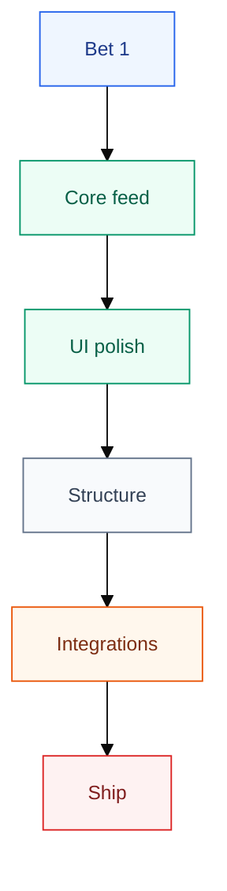

# buildlog

A public build-log microblog for short daily entries about what is being built and learned. This is the first app in the Rails portfolio Shape Up bet: public feed for readers, auth-gated posting for the single author.

## Product Shape

- Public feed, newest first.
- Individual entry pages for durable links.
- RSS feed for following without social platforms.
- Feedback page with a configurable public form plus GitHub Issues for developer feedback.
- Author-only posting flow with Rails built-in authentication.
- Lightweight visual identity distinct from `ozzo.blog`: logbook icon, mint paper background, teal ink, and coral accent.

## Stack

- Rails 8.1 with built-in auth and Solid Queue/Cache/Cable.
- SQLite in development and production. No Postgres, no Redis.
- Tailwind CSS v4 plus DaisyUI 5.
- Kamal deploys production images to DigitalOcean via GitHub Container Registry.

## Local Development

Requires Ruby 3.4.1 and Node 22.

```sh
npm install
bin/rails db:prepare
bin/dev
```

The development server runs at `http://localhost:3000`.

Tests:

```sh
bin/rails test
bin/rails test:system
```

If SQLite cannot open the repo-mounted `storage/*.sqlite3` files on an external volume, use a temp database for local verification:

```sh
DATABASE_URL=sqlite3:///tmp/buildlog-dev.sqlite3 bin/rails db:prepare
DATABASE_URL=sqlite3:///tmp/buildlog-dev.sqlite3 bin/rails server
```

## Roadmap

The roadmap uses compact Mermaid flowcharts with short labels and one planning question per diagram.

### Bet Flow



## Current Priorities

1. Keep the public feed simple and readable.
2. Link the finished project from `ozzo.blog/projects`.
3. Capture launch material from real buildlog entries, not a separate content process.
4. Keep tags, filtering, search, and MCP out of Bet 1 unless a later pitch reopens them.

## Deploy

Production is deployed with Kamal to a DigitalOcean droplet. Images are pushed to `ghcr.io/ozzgio/buildlog`.

Secrets live outside the repository:

- `RAILS_MASTER_KEY` is read from `config/master.key`.
- `KAMAL_REGISTRY_PASSWORD` is resolved from `gh auth token`.
- `BUILDLOG_FEEDBACK_URL` points to the public Tally form embedded at `/feedback` (`https://tally.so/r/QKa62p`).

```sh
bin/kamal deploy
```
